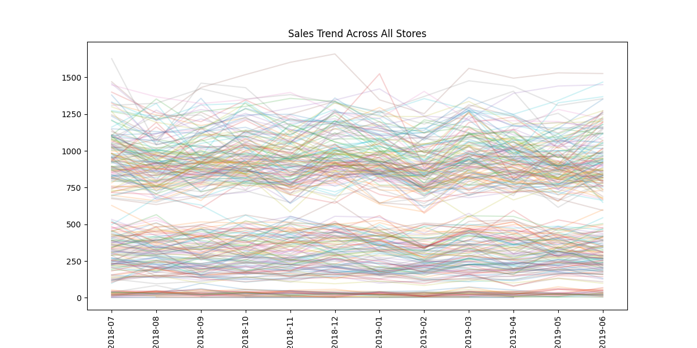
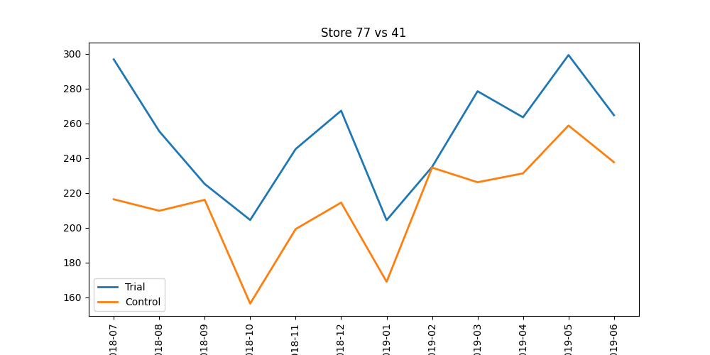
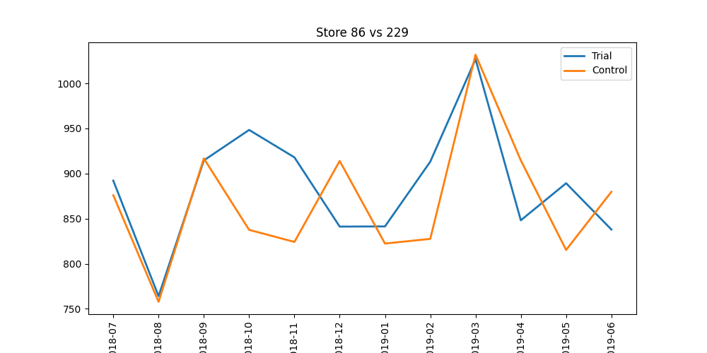
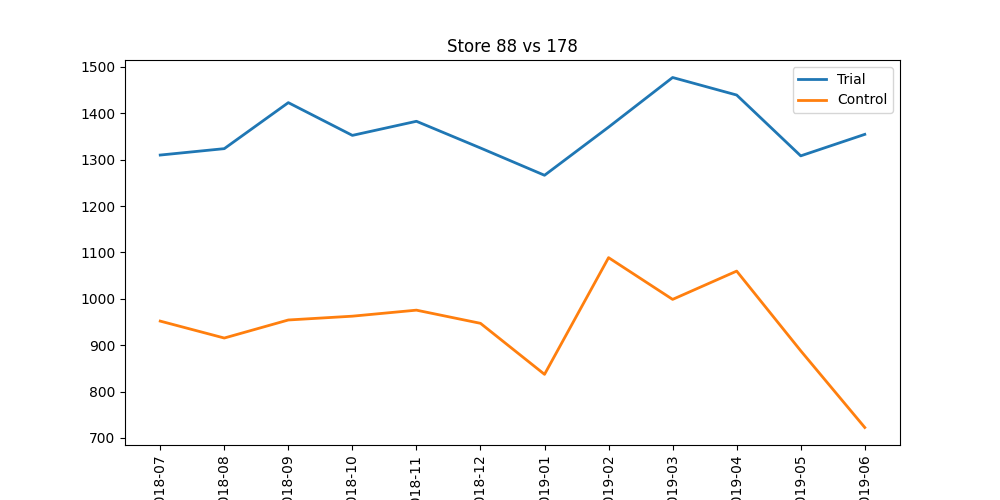
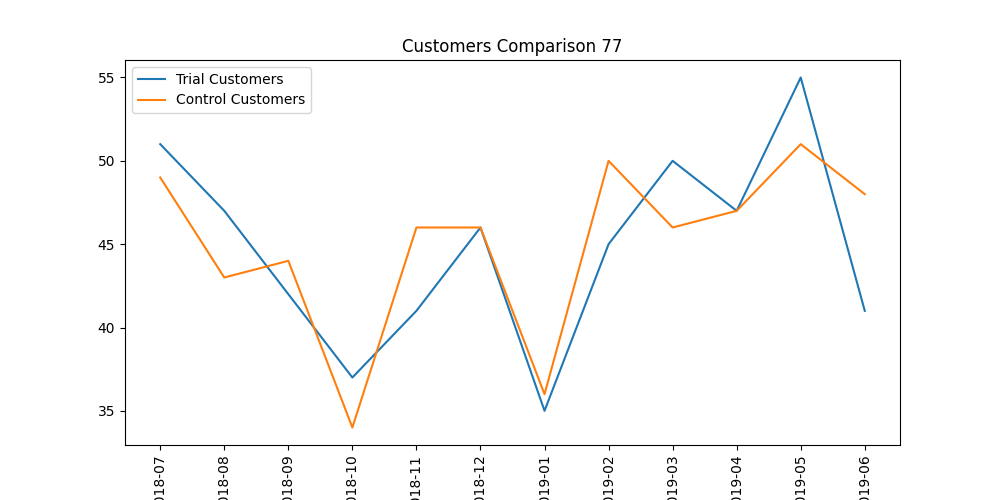
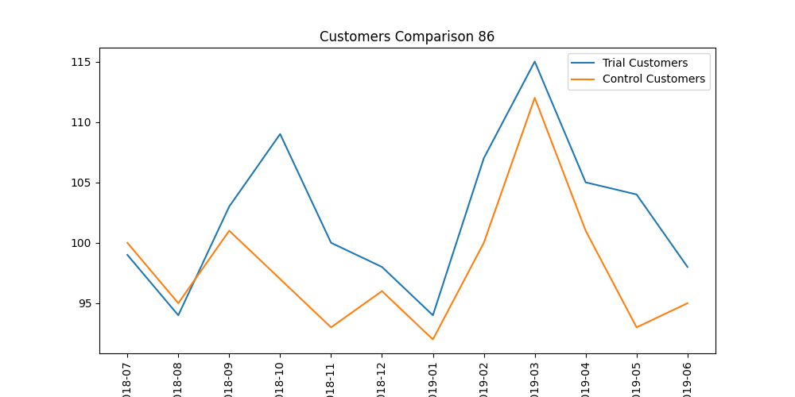
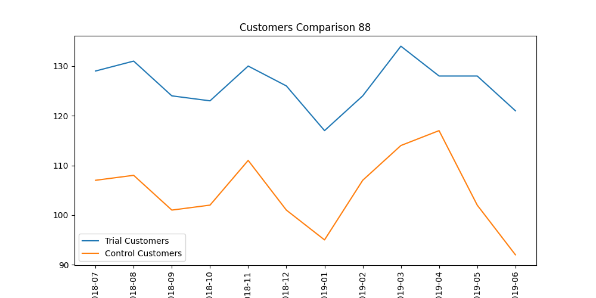
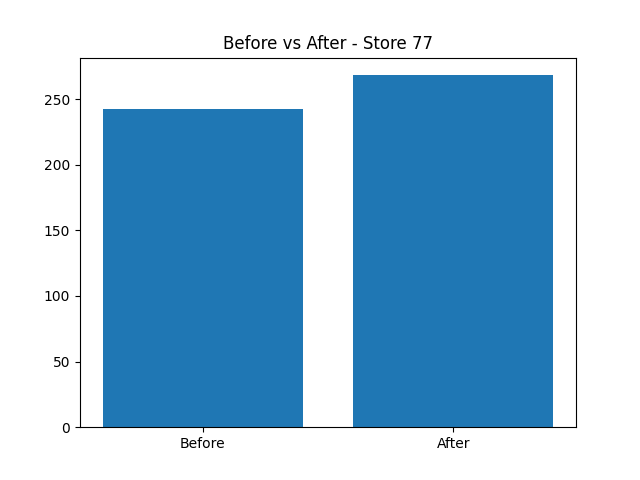
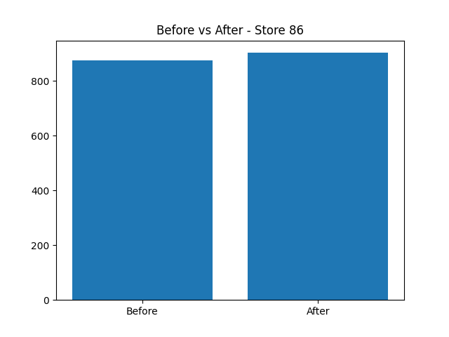
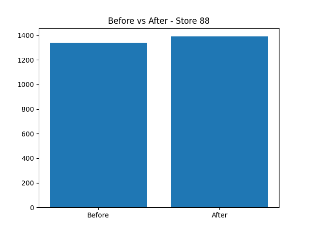

# Store Trial Analysis Dashboard

> Retail Analytics Project | Python | Data Visualization  

---

## Project Overview

This project evaluates the performance of **trial stores (77, 86, 88)** by comparing them with similar **control stores** using data-driven techniques.

---

## Key Results

| Trial Store | Control Store | Similarity Score |
|------------ |---------------|------------------|
| 77          | 41            | 0.76             |
| 86          | 229           | 0.67             |
| 88          | 178           | 0.65             |

---

## Sales Trends (All Stores)

---

## Trial vs Control (Comparison Dashboard)

### Store 77 vs Control 41

### Store 86 vs Control 229

### Store 88 vs Control 178

---

## Customer Behavior

### Store 77

### Store 86

### Store 88

---

## Before vs After Impact

### Store-77

### Store-86

### Store-88

---

## Insights

- Trial stores showed **moderate to strong similarity** with selected control stores  
- Store 77 had the **highest similarity (0.76)**  
- Data limitations impacted statistical testing  
- Customer behavior plays a key role in sales variation  

---

## Challenges

- Limited overlapping time periods  
- Sparse data affecting correlation  
- Real-world data inconsistencies  

---

## Tech Stack

- Python
- Pandas  
- NumPy  
- Matplotlib  
- Seaborn  

---

## Project Structure

Store-Trial-Analysis/
│
├── data/                          # Raw dataset
│   └── QVI_data.csv
│
├── src/                           # Core logic (Python code)
│   ├── main.py                    # Entry point (run this file)
│   ├── preprocessing.py           # Data cleaning & aggregation
│   ├── similarity.py              # Control store selection logic
│   └── visualization.py           # All graphs generation
│
├── outputs/                       # Saved visualizations
│   ├── sales_trend.png
│   ├── trial_vs_control_77.png
│   ├── trial_vs_control_86.png
│   ├── trial_vs_control_88.png
│   ├── customers_77.png
│   ├── customers_86.png
│   ├── customers_88.png
│   ├── before_after_77.png
│   ├── before_after_86.png
│   ├── before_after_88.png
│   └── heatmap.png
│
├── README.md
├── requirements.txt
└── .gitignore
